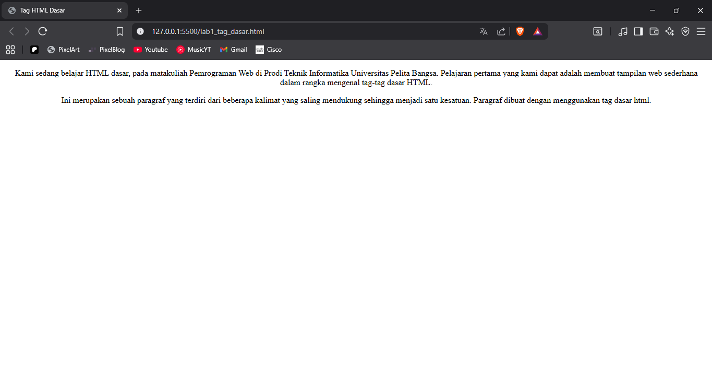
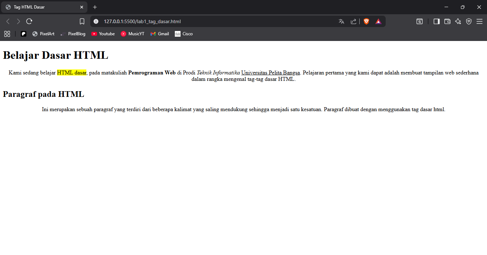
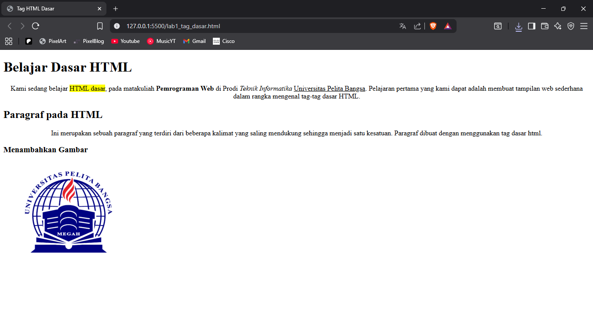

# Lab1Web
## Agus Ramadhani (312410059)

### 1. Membuat Title
Saya membuat judul halaman dengan tag `<title>` yang diletakkan di dalam bagian `<head>`.

### 2. Mebuat Paragraf
Saya menambahkan paragraf dengan tag `
`. Paragraf digunakan untuk menuliskan teks pada halaman web. kemudian memposisikan ke tengah dengan align="center"

### 3. Menambahkan Judul Paragraf
Saya menambahkan judul dengan tag heading `<h1>`, dan `<h2>` sesuai tingkat kepentingan.

### 4. Memformat Teks
Saya melakukan pemformatan teks dengan beberapa tag:

`<b>` → tebal

`<i>` → miring

`<u>` → garis bawah

`<mark>` → highlight

### 5. Menyisipkan Gambar
Saya menambahkan gambar menggunakan tag  dengan atribut src, dan mengatur ukurannya dengan width.

### 6. Menambahkan Hyperlink
Saya menambahkan navigasi dengan tag <a> untuk membuat hyperlink, baik menuju halaman lain di repo maupun ke web eksternal.

